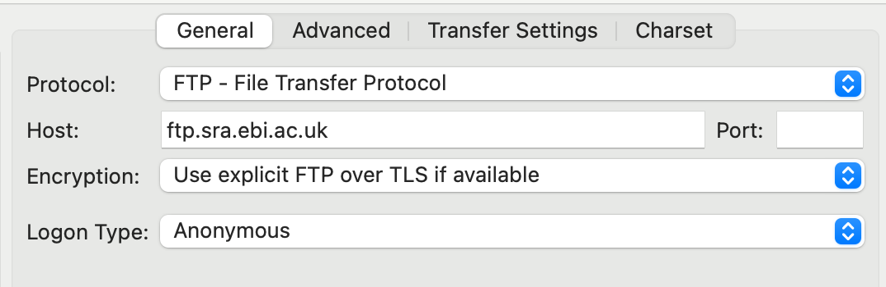

!!! example "Our story"
    Our project **Genetic variation of listeria in the cow brain** has the aim to gain knowledge about the genetic variability of listeria. At the start of the project, we want to know what kind of data is already available, and see whether we can re-analyze it to understand the genetic variation of *Listeria monocytogenes* associated with cows.

## Exercises

### Finding data

You are asked to figure out what kind of raw sequencing data is already available to do the analysis. As a start, we go to the [ENA search page](https://www.ebi.ac.uk/ena/browser/search), and type in *Listeria monocytogenes*  in the search box. 

**Exercise**: Look for *Listeria monocytogenes* in the general search. Do you find many raw read datasets? Are they all relevant to our question? 

??? success "Answer"
    At time of writing I find 28,613 runs associated with *Listeria monocytogenes*. They probably aren't all useful. For example, we are interested in Listeria associated with cows, and probably most of those entries have a different origin (e.g. food/lab). In addition, some might contain only a part of the genome because it's enriched by e.g. PCR, and there is variation in the sequencing technology used, which could complicate our downstream analysis. 

We probably want to search a bit more specific. Go to the [advanced search page](https://www.ebi.ac.uk/ena/browser/advanced-search). We will be looking for raw reads. Let's search for the following characteristics:

- Organism *Listeria monocytogenes*
- Illumina whole genome sequencing
- Host: cow (*Bos taurus*)

Build a query by selecting the boxes and selecting and specifying fields. Have a particular look at:

- Taxonomy and related
- Host information
- Sequencing information

!!! hint 
    Find the description of all possible fields [here]([here](../assets/ENA%20Portal%20API%20-%20enaPortalAPI-doc-1.pdf)). 

 You'll notice that a search query will appear at the top of the page. What does your query look like?

??? success "Answer"
    Here's an example of a query you could end up with:
    ```
    tax_eq(1639) AND host_scientific_name="Bos taurus" AND instrument_platform="ILLUMINA" AND library_strategy="WGS"
    ```

Ignore the other steps for now and click 'Search'. You will find the accession and the Run accession and the description of the run. 

**Exercise:** What kind of other information would you want to evaluate our search? 

??? success "Answer"
    Some information that might be nice:

    - To which original study and sample the run belongs
    - The host information
    - Where to find the data files
    - Date of sampling/submission
    - The geographic origin
    - The strain/serotype

You can change the results fields by going two steps back in the fields selection page. 

**Exercise**: Navigate to the 'Fields' page, and select **Manually select fields** to select fields that interest you and correspond to the required information in the answer above. Find all field descripts [here](../assets/ENA%20Portal%20API%20-%20enaPortalAPI-doc-1.pdf).

??? success "Answer"
    Here's an example of the fields you could have selected:

    ```
    study_accession,library_selection,country,collection_date,first_public,strain,host,host_status,isolation_source,serotype,submitted_ftp,fastq_ftp
    ```

Download the results as tsv. Are there many researchers that specified the serotype or strain? How about the isolation source?

### Downloading data through ftp

There are quite a few ways to download data from ENA/ISNDC:

- Through FTP:
    - From the command line with `wget` or `curl`
    - With FileZilla
- Through the command line with [SRA tools](https://github.com/ncbi/sra-tools/wiki) with `prefetch` and `fasterq-dump`
- Via [SRA cloud delivery](https://www.ncbi.nlm.nih.gov/sra/docs/data-delivery/)

!!! note "Nextflow pipeline"
    With the nf-core pipeline [fetchngs](https://nf-co.re/fetchngs), it's easy to download sequencing reads from SRA/ENA and have them in the right format for downstream processing with other nf-core pipelines.

In the exercises below we will use FileZilla to download some files of interest. 

Make sure that you have specified `submitted_ftp` and `fastq_ftp` at *Fields*. After that, at *Results* download the report in tsv format (**Download report** > **TSV**). Open the downloaded TSV in your favourite spreadsheet program, and pick a sequencing run with both submitted data and fastq data available. For example, you can use `ERR10549500`. 

!!! hint "File size"
    In the exercises, you will download the files. Find a sequencing run that's not too big, to do that, you can include `submitted_bytes` and/or `fastq_bytes` at *Fields* 

Now we'll browse the files with Filezilla. To do that we need the links provided at the columns `submitted_ftp` and `fastq_ftp`. The first part is the address to the FTP server: `ftp.sra.ebi.ac.uk`. To connect to that we make a connection with FileZilla:

- **File** > **Site Manager..**
- Click **New Site**
- Give the connection a name e.g. 'ENA SRA'
- Specify at **Host** `ftp.sra.ebi.ac.uk`
- At **Logon Type** specify **Anonymous**

<figure>
    
</figure>

Connect to the server. Now at the right panel you can browse to the paths in the links. To browse to the directory with the submitted data for `ERR10549405`, you can go to `/vol1/run/ERR105/ERR10549500/`. 

**Exercise** For your sample of interest, download a submitted file and the SRA fastq file. What are the differences? 

??? success "Answer"

    The first eight lines of the SRA fastq file looks like this:

    ```
    @ERR10549500.1 NB502092:214:HCYYFAFX3:1:11101:10005:17165/1
    AATTTCACCTTCATTAATAGATTTTTTTCTTTTAACGTCTTATAATGAAATGGAACCGAGAACATACGCGAATATGTTCTCGGCTCATTTCTAAGGATGACTACTGTAAAACATCTGAGCCCGAGAAGCTTTGGATTCGTTTGCACGGTTA
    +
    AAAAAE/A<EEEEEE/AA6EE6EEEE/EEEEEEEEEEEE//A/AAEAAEEE//AAEAEEAE/EEEEE<<E<EEE/<AAEEA/</6EE/</EEA/6/EEAEEAEE</EE<EEEEEEAAEA//66E<AAA<EE/<<<EE<A/<//6A/6/EE/
    @ERR10549500.2 NB502092:214:HCYYFAFX3:1:11101:10012:8474/1
    ATCCTTATCTAATCACTTCTATCGCTGTGTTCTACGATGATTTATACGCAGCAACAGAAGGCACTTTTACAGAAGAAACGGTCATCGTGGAAGAAGAAGTAAATCCATTTGGAACAACAGAAGCTGATCCATTTGCTGAAGATACACATC
    +
    AAAAAEEEEEEEEEEEEEEEEEEEEEEEEEEEEEEEEEEEEEEEEEEEEEEEEEEEEEEEEEEEEE<EEEEEAEEEEEEEAEEAEEEEEEEEEEEE/EEEEEEEEEEEEEEEEEEEEEAEAEEEEE<EEAEEEE<AEE/EE/EEEEAAE<
    ```

    While for the submitted file it looks like:

    ```
    @NB502092:214:HCYYFAFX3:1:11101:19008:1109 1:N:0:GCTCATGA+NTAGCCTT
    GACTTNTTGGGATTAGTGAAGGGGCAATTCCTTTCGCGGTAGAATCTCCGCTTAAAGTTATTCCGGCTACGGTTCTTGGTTCTGCTGTCGGCGGGGCACTAGCTGTAGGTCTTGGCGCAATTAACCAAGCGCCAATCAGTGGTTTTTATGG
    +
    AAAAA#/EEAE6EEAEEE/EEEEAEE/AEEEEE/AAEE/AAEE/EEEEAAEAEEEEEEEEEEEEEEAEEEEEEEEEEEEEEEEEEEAAEEE<EEEEEEEEEEEE/E<EE/AEE<EEEEAEEEE/EEE/AEEEEEA<EAEEAEE/E<E/EA<
    @NB502092:214:HCYYFAFX3:1:11101:9681:1109 1:N:0:GCTCATGA+NTAGCCTT
    GACTGNACAGATGTGCCGATGTTTGTTAAACAAGGTGCCATTATGCCAATGCAACAACCACAAAACTATGTTGGCGAATCCGCAGTCAAAACAATTTATTTAGACACTTTTGCATCAGATAAAGAGACATCCTTTACACATTACGATGACG
    +
    AAAAA#EAEEEEEEEEEEEEEEEEEEEEEEEEEEEAEAEEEEEEEE/E/EEEEEEE/EEEEEEEEEEAAEAEEEEEEEEE6EEEEEEEEAAEEE/EEE/E<AAAE/A<<EEEAEA6EEAEEEEEAEEEE/AEEEEAE/AEAAE<AEAAAA<
    ```

    So, apparantly both the order and the titles are different. They both have the same number of reads:

    ```sh
    gunzip -c ERR10549500_1.fastq.gz| wc -l
    gunzip -c DTU_2022_1015394_2_SI_JC98_R1_001.fq.gz | wc -l
    ```

    Both return 3657672

!!! note "Using `wget`"
    Of course, if you have a lot of runs you need to download, or if you are downloading to e.g. a remote cluster with only a commmand line interface, you can use `wget` or `curl`. For our exercise, the commands for `wget` would look like this:

    ```sh
    # SRA fastq
    wget ftp.sra.ebi.ac.uk/vol1/fastq/ERR105/000/ERR10549500/ERR10549500_1.fastq.gz
    # submitted fastq
    wget ftp.sra.ebi.ac.uk/vol1/run/ERR105/ERR10549500/DTU_2022_1015394_2_SI_JC98_R1_001.fq.gz
    ```