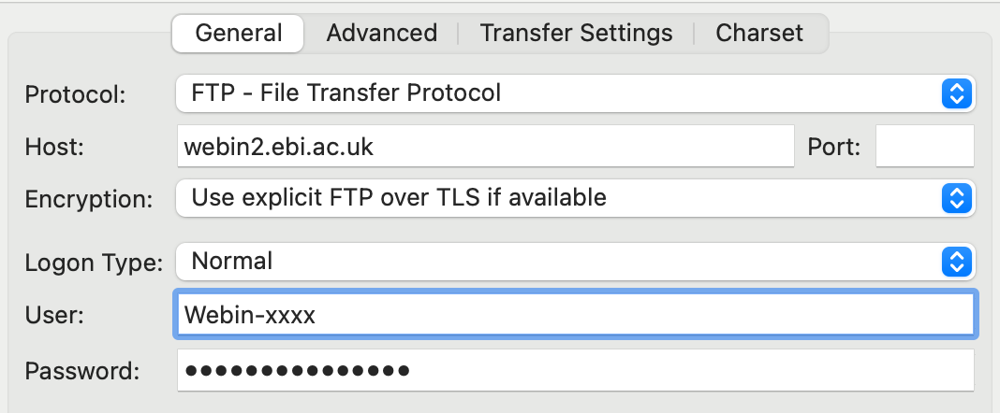

## Material

[:fontawesome-solid-file-pdf: Download the presentation](../assets/pdf/metadata_and_submitting_sequences.pdf){: .md-button }

!!! example "Our story"
    Our project **Genetic variation of listeria in cow** has the aim to gain knowledge about the genetic variability of listeria. As a first step, we isolated *Listeria monocytogenes* from two different cow milk samples (sample LIS001 and LIS002). The milk was collected at January 2022 at two dairy farms, one near Bern (CH), and the other near Fribourg (CH). We received them on February 2nd of the same year in our lab. By whole genome sequencing we found out that LIS001 belongs to serotype 4b and LIS002 to serotype 1/2b. We performed paired-end sequencing on an Illumina MiSeq (2 x 150 bp) on DNA extracted from both isolates. You can find the raw reads [here](https://ena-seqdata-training.s3.eu-central-1.amazonaws.com/listeria_reads.tar.gz). 

## Exercises

You are asked to submit the reads to a repository at EBI. First, figure out what the best submission strategy is at the [submission wizard](https://www.ebi.ac.uk/submission/). 

??? success "Answer"
    After answering the questions, you probably conclude you should submit to [ENA](https://www.ebi.ac.uk/ena/browser/submit). 

If you haven't already got one, make a [Webin account](https://www.ebi.ac.uk/ena/submit/webin/login). After the creation of the Webin account we will continue in the dev environment at [https://wwwdev.ebi.ac.uk/ena/browser/home](https://wwwdev.ebi.ac.uk/ena/browser/home). 

!!! warning "From now on dev environment!"
    Make sure you use the dev environment [https://wwwdev.ebi.ac.uk/ena/browser/home](https://wwwdev.ebi.ac.uk/ena/browser/home). Otherwise the reads will be submitted and stay at ENA!

We will follow the route **Submit to ENA using the Webin Portal**, which requires four steps. 

### 1. Register study

A study (or project) is an entity describing a research project. Typically this is at the level of a research grant. This make it e.g. easy to find data from multiple experiments from the same study. Click on **Register study** and fill out the form for the project described above. 

!!! note 
    The descriptions do not have to belong for this example. Typically, you can copy-paste this information from e.g. the research proposal. 

### 2. Register samples

Go back to the [submission portal main page](https://wwwdev.ebi.ac.uk/ena/submit/webin/), and click **Register samples**. Start by finding a sample template. 

**Exercise**: What would be the most appropriate template for our project?

??? success "Answer"
    *Listeria monocytogenes* is a pathogen, so as checklist group we select **Pathogens Checklists**. It is food-borne, so the first one **COMPARE-ECDC-EFSA pilot food-associated reporting standard** could be appropriate. However, we can't specify the host (cow) in there. So we choose the alternative: **ENA prokaryotic pathogen minimal sample checklist**. 
    
**Exercise**: Check out all fields (including recommended and optional). Any field you want to add/remove? 

??? success "Answer"
    We don't have information about where the samples were exactly collected, so we can uncheck `lat_lon` at 'Recommended fields'. We can also uncheck `strain` because we don't have any strain information. 

**Exercise**: Now download the template as tsv, and edit it in e.g. excel for our two samples (LIS001 and LIS002). Do not change the first three lines. For your convenenience, keep the field description open, so you know what to fill out. 

!!! info "Hint"
    In order to find the taxonomy ID (`tax_id`), use [NCBI Taxonomy](https://www.ncbi.nlm.nih.gov/taxonomy) to find it. 

??? success "Answer"
    You can find an example of a 'correctly' filled out table [here](../assets/tsv/Checklist_samples.tsv).

### 3. Upload reads

Before we submit the reads, we first need to upload them. We will use the ftp protocol with FileZilla.

!!! note
    Find all ways to upload sequence reads to ENA [here](https://ena-docs.readthedocs.io/en/latest/submit/fileprep/upload.html).

Get the reads we will submit [here](https://ena-seqdata-training.s3.eu-central-1.amazonaws.com/listeria_reads.tar.gz). After downloading, extract the tar file. 

To upload the reads, create a new Site that connects to `ftp://webin2.ebi.ac.uk` in FileZilla:

- **File** > **Site Manager..**
- Click **New Site**
- Give the connection a name e.g. 'webin upload'
- Specify at **Host** `webin2.ebi.ac.uk`
- At **User** and **Password** specify your Webin username and password

<figure>
    
</figure>

After filling out the connection details, click **Connect** to connect to your personal space on the ftp server.

If the connection was successful, browse to the sequence files on your local computer in the left pane, and drag them to the window on the right pane (the ftp server). 

### 4. Submit Reads metadata

Go back to the [submission portal main page](https://wwwdev.ebi.ac.uk/ena/submit/webin/), and click **Submit reads**. Like with the samples, we will download and fill out a template. 

**Exercise** Check out the template choices. What would be the most appropriate template?

??? success "Answer"
    We have paired fastq files, so we'll choose **Submit paired reads using two Fastq files**. 

**Exercise**: Again check out the mandatory and optional fields. Any field you would like to add from **Optional Fields**?

!!! note "Check 'Show Description'"
    The descriptions do not show by default for the read submission template. View it by checking 'Show Description' at the top of the page. 

??? success "Answer"
    No, probably nothing to add because we don't have that information. If you have this kind of info, don't hesitate to add it!

You have probably seen the fields 'forward_file_md5' and 'reverse_file_md5'. md5 checksums are used to check whether the file transfer has completed completely without error. You can calculate them like this:

=== "Linux/MacOS/WSL"
    ```sh
    md5sum *.fastq.gz
    ```

=== "Windows"
    ```powershell
    CertUtil -hashfile LIS001_R1.fastq.gz MD5
    CertUtil -hashfile LIS001_R2.fastq.gz MD5
    CertUtil -hashfile LIS002_R1.fastq.gz MD5
    CertUtil -hashfile LIS002_R2.fastq.gz MD5
    ```

**Exercise**: download the template and fill out the required information.  Check the field description and permitted values in the template description. You can also find an overview of permitted values [here](https://ena-docs.readthedocs.io/en/latest/submit/reads/webin-cli.html#metadata-validation).

??? success "Answer"
    You can find a 'correctly' filled out table [here](../assets/tsv/fastq2_template.tsv). 

Now you can upload the file at **Upload filled spreadsheet template for Read submission**, and the website will tell you if it has been submitted successfully. Now at the side of ENA the files and md5 sums will be checked. If that has occurred successfully (usually occuring over night) you're all set! At **Run files report** you can check the status of the files. 

### Extra: submit with webin CLI

Submission though webin CLI requires the same steps for registering a study and registering samples. However, the process of submitting the reads is done programatically. A general overview on how to use Webin CLI for reads can be at the [ENA docs](https://ena-docs.readthedocs.io/en/latest/submit/reads/webin-cli.html). 

To do these exercises, follow [these instructions](https://ena-docs.readthedocs.io/en/latest/submit/general-guide/webin-cli.html) to install Webin CLI locally. 

Submitting with Webin-CLI starts with creating a json manifest file, in which you specify the metdata associated with your reads. This metadata json basically contains the same information as in the read submission template that we have created above. Here's an mostly empty example:

```json title="manifest.json"
{
    "study": "PRJEB00000",
    "sample": "ERS00000000",
    "name": "",
    "platform": "",
    "instrument": "",
    "libraryName": "",
    "library-source": "",
    "library_selection": "",
    "libraryStrategy": "",
    "fastq": [

      {
        "value": "LIS001_R1.fastq.gz",
        "attributes": {
          "read_type": "paired"
        }
      },
      {
        "value": "LIS001_R2.fastq.gz",
        "attributes": {
          "read_type": "paired"
        }
      }
    ]
   }
```

!!! note "Creating json files"
    Typically such a json files is generated programmatically with e.g. R or python. 

**Exercise** fill out this json for the reads associated with LIS001. Use the [ENA docs](https://ena-docs.readthedocs.io/en/latest/submit/reads/webin-cli.html#metadata-validation) to find the permitted values. 

??? success "Answer"
    Here's an example. Note that `study` and `sample` are likely different for you. 

    ```json title="manifest_LIS001.json"
    {
    "study": "PRJEB62850",
    "sample": "ERS15567929",
    "name": "LIS001",
    "platform": "ILLUMINA",
    "instrument": "Illumina MiSeq",
    "libraryName": "LIS001",
    "library-source": "GENOMIC",
    "library_selection": "RANDOM",
    "libraryStrategy": "WGS",
    "fastq": [
        {
        "value": "LIS001_R1.fastq.gz",
        "attributes": {
            "read_type": "paired"
        }
        },
        {
        "value": "LIS001_R2.fastq.gz",
        "attributes": {
            "read_type": "paired"
        }
        }
    ]
    }
    ```

Now, we can use Webin CLI to validate and submit the reads. On a UNIX-based system it would look like this:

```sh
java -jar webin-cli-6.4.1.jar \
    -context reads \
    -userName Webin-XXXXX \
    -password "$WEBIN_PW" \
    -manifest manifest.json \
    -outputDir . \
    -validate \
    -submit \
    -test
```

**Exercise** Make sure that you have the webin-cli executable, manifest file and reads are in the same directory and run the command. 

!!! hint
    You can store you password in a variable like this:

    ```sh
    export WEBIN_PW=mywebinpassword
    ```

!!! warning
    Make sure to add the `-test` option, otherwise Webin CLI will try to submit your reads!
